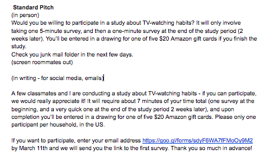
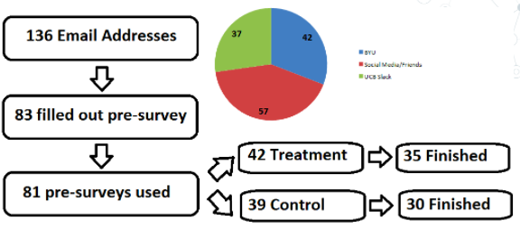
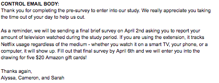
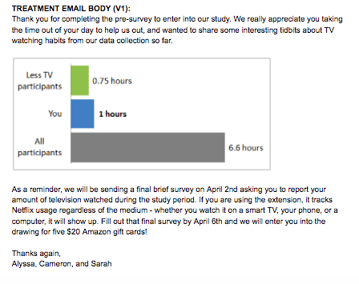

```{r setup, include=FALSE}
# Tidy up any code printed in pdf
library(knitr)
opts_chunk$set(tidy.opts=list(width.cutoff=60),tidy=TRUE)
```

```{r, include=FALSE}
# Load libraries
library(data.table) 
library(lmtest)
library(ggplot2)
library(tidyr)
library(dplyr)
library(reshape)
library(corrplot)
library(stargazer)
library(gridExtra)
library(data.table)
``` 

##Introduction

Nielsen Total Audience report for the fourth quarter of 2016 discussed the steady trend of decline in live TV watching alongside increased use of smartphones to view video and the increasing penetration of subscription video on demand. While live viewing decreased to 4 hours and 23 minutes a day among adults 18 years and up (from 4 hours and 27 minutes in the prior year), smartphone usage rose to 2 hours and 32 minutes a day from 1 hour and 15 minutes a year ago. Needless to say, individuals are consuming video content in more formats today and given the rate at which online and on-demand content is growing, consumers can access an endless amount of content right at their fingertips. This points to a trend of increased video/screen watching and could mean that consumers are watching more TV than they actually realize or desire. 

In other contexts, it has been found that providing peer comparisons can cause changes in people's behavior. For example, in the Opower study by Ian Ayres, Sophie Raseman, and Alice Shih, they find that providing mailed peer feedback reports resulted in reductions in energy consumption. We are interested in whether a similar mechanism can be applied to the new context of TV watching habits. 

We set up an experimental study where we randomly assigned treatment emails to half of the participants that summarizes how much their peers are watching television on average. We wanted to understand if social/peer pressure has the ability to impact how much television a person watches (e.g. "Wow, my peers are watching only 2 hours of TV a week and I'm watching at least 10. Shame on me."). 

We begin by discussing the high level experimental design we developed to test whether social pressures/influence can actually impact individual behavior as it relates to TV watching, including changes based on an initial pilot study. Next, we discuss the details of our real experiment - the participants, the nature and frequency of the treatment, and our outcome measures. Statistical analysis from our study suggests that XXXXXXX taking into account non-compliance and attrition aspects of the experiment. We conclude by discussing the implications for generalizability to a broader population at large and future potential avenues for exploration.

##Experimental Design

Our aim was to develop a means for studying the influence of social pressures on TV watching, recognizing that the means by which Americans consume TV is very diverse today (cable, online video streaming, YouTube, etc) and what people classify as television can vary quite a bit (e.g. television shows, news, sports, movies, YouTube clips, etc). We hypothesized that when we carefully defined what we classify as "television" watching and participants could compare apples to apples their consumption vs. peers, they'd be impacted if their peers were watching less than they were. We also hypothesized that we'd see heterogeneous treatment effect from our participants based on amount of TV watched prior to experiment (ie. those in 1st quartile are not likely to reduce their amount of TV and may actually see an increase instead).  

We decided on surveys as the means by which we would collect all the necessary information including outcome measures from our participants. Our experimental design follows a difference in difference approach. Our experiment consisted of two surveys - one pre and one post treatment. In the pre-survey,  we would measure pre-survey TV behavior for all participants along with what we thought could be key covariates of interest (age, gender, marital/employment status, etc). Then we would randomly assign individuals to treatment vs. control, where the individuals in the treatment group would be aware of how much their peers were watching. The post-survey measures TV behavior during the experiment. This allows us to compare the hours of TV watched between treatment and control group for causal estimate conditioning on pre-experiment TV watching measure as a covariate.

```{r echo=FALSE, fig.cap="Experimental Design", out.width = '100%'}
knitr::include_graphics("design.png")
```

In designing our study, we were very mindful of how to maximize participation to get a large enough sample size, get accurate reportings, and how we could extract the most information in the least intrusive way. On the latter, conversations with our peers made us realize that there was clearly a balance between incentives for participants and the time commitment involved. We offered a drawing for 5 Amazon gift cards for $20 each as a reward for participating, with the stipulation that participants had to complete a 3 minute pre-survey and a 1 minute post-survey in order to be entered into the drawing. 

**Pilot Study**

We implemented a pilot study with 9 individuals to test our initial design framework and help identify potential problems and inform our power analysis. The pilot took place over the course of 1 week (Feb 26 - Mar 4) where friends and family answered a pre-survey, were randomly assigned to control or treatment, treatment group was sent an email about peer usage, and then everyone filled out a post-survey on their TV consumption. See the Appendix for full questionaires.

*Learnings and adjustments in the experimental design:*

1. Attrition is likely to be high. Of the 9 close family and friends that we targeted for the survey, we ended up with full observation sets for only 7 of 9. Of course the short observation time had an impact in the case of the pilot. To reduce attrition as much as possible in order to maximize the inference ability of the experiment, we incorporated more time for individuals to fill out both the pre- and post-survey and planned to send several reminder emails emphasizing the Amazon gift card drawing for completing participation in the study.

2. The quality of the data coming out of the Chrome extension reading was low - 3 of 7 individuals had 0 or NA output even though they indicated they watched TV during that time. This emphasized that we needed to incorporate more optional language around the Chrome Netflix extension. We didn't want to make installation of that extension and its output such a strong requirement with the fear that it would reduce our subject pool too severely. 

3. The data from the self-reported average amount of TV watched did not have much variability. This was in part due to the low number of participants, but also because the response options were a limited set of ranges of hours. This made the treatment less effective in showing variation, so we changed the question about pre-experiment self-reported TV to have participants enter their own value instead of selecting a radio button.

4. We emailed the pre- and post-surveys out via Qualtrics with the sender name as "UCBerkeley TV Habits Study" but the treatment email came from Alyssa's gmail, raising the question if this created confusion and/or potential for individuals to ignore Alyssa's emails (non-compliance). To resolve this, we created a gmail account with the same title as the Qualtric email sender which is "UCBerkeley TV Habits Study."

**Calculating Power**

The pilot also provided reference information for a power calculation that would help us understand what level of treatment effect we would be able to accurately identify. We ran a simulation regressing outcome TV on treatment and using the pre-experiment amount of TV watched as a covariate to reduce our SE and increase the power, and checked the proportion that found a statistically significant coefficient for treatment. We made the following simplifying assumptions for our simulation:

- set mean and variance for self-reported pre-experiment TV hours watched
- each individuals potential outcomes to control are normally distributed with mean of that individuals TV prior to experiment, and a SD value provided as an input
- treatment effect is constant for everyone

Since the pilot was so short, we did not get a good estimate of the treatment effect and we have no data for individual SD for TV watched. Instead, we run across a variety of treatment effects and SD values and check the power for that combination of parameters.

First, we ran this analysis using the pilot mean and variance for pre-experiment hours of TV (7.6 and 5.25 respectively). We found that for 100 participants and an individual SD of 2.5, we would need a treatment effect of -1.5 hrs/week to have 80% power. We updated and re-ran this analysis after gathering the pre-survey data for the real experiment, leading to the chart below. Here we only use 80 participants, and the mean and variance for pre-experiment hours of TV from the pre-survey (8.6 and 6.25). If the individual SD was about half that of the overall population (3), we would need a treatment effect of -2 hrs/week to have 80% power.

```{r fig.height= 3.5, echo=FALSE}
individual_simulation_covariate <- function(
  units, mean_control, sd_control, tau, sd_individual) {
  ## units is our sample size
  ## mean_control is the mean TV watched prior to experiment
  ## sd_control is the standard deviation in TV watched prior to experiment
  ## tau is the treatment effect (change in amount of TV for treatment)
  ## sd_individual is the SD for an individuals weekly TV watched with no treatment
  
  ## Assume simple randomization among all units with 50% probability of treatment
  urn <- c('treat', 'control')
  d <- data.table(id = 1:units)
  d[ , condition := sample(urn, size = .N, replace = TRUE)]
  d[ , treated := as.numeric(condition == "treat")]
  
  ## Assumes a normal distribution of pre-experiment avg weekly TV
  ## Mean and SD are supplied to function
  ## Assumes each individual has a normal distribution centered on their pre-experiment value
  ## Assumes a constant treatment effect across all participants
  d[ , preTV := pmax(rep(0, units),rnorm(units,mean=mean_control, sd = sd_control))]
  d[ , Y0 := pmax(rep(0, units),rnorm(units,mean=preTV, sd = sd_individual))]
  d[ , Y1 := pmax(rep(0, units),Y0 + tau)]
  d[condition == 'control' , outcome := Y0]
  d[condition == 'treat' , outcome := Y1]

  ## Run a regression including preTV as a covariate
  model <- lm(outcome ~ treated + preTV, data=d)
  
  res <- list(
  'pvalue' = coeftest(model)[2,4],
  'tau' = tau, 
  'sd_individual' = sd_individual,
  'baseline_n'    = d[condition == 'control', .N],
  'alt_n'         = d[condition == 'treat', .N],
  'df_n'          = d[ , .N],
  'ate'           = unname(model$coefficients[2])
  )

  return(res)
}

# Allow treatment effect and sd_individual to vary and run many simulated experiments
# Note this takes over ten minutes to run
moving_tau <- seq(from=-1, to= -4, by=-.1)
moving_sd_individual <- seq(from=1, 5, by=0.2)

results <- replicate(50000, 
                     individual_simulation_covariate(80, 8.6, 6.25, sample(moving_tau, size = 1), sample(moving_sd_individual, size=1)),
                     simplify = FALSE)
results <- rbindlist(results)
results$sig <- as.numeric(results$pvalue<0.05)

# Calculate power at each treatment effect level and plot them
results_agg <- aggregate(sig ~ tau + sd_individual, FUN=mean, data=results)
results_agg$over80 <- factor(as.numeric(results_agg$sig>=0.8))

ggplot(results_agg, aes(x=tau, y=sd_individual)) +
  geom_raster(aes(fill = sig)) +  scale_fill_gradientn(colours = rev(terrain.colors(10))) + 
  ggtitle("Power Level by Treatment Effect Size and Individual SD")

```

##The Actual Experiment  

**Subjects**  

In an ideal scenario,  we would survey a large sample of the US adult population in order to get a representative sample for our experiment. However, with the key constraints being time and resources (we have only about 10 weeks and $500), we implemented a much more limited study where we, ourselves, were tasked with finding our respondents by word of mouth and social media.

We recruited on college campuses and posted on social media to get participants. We chose to limit participants to one per household to avoid problems with non-interference. Even though we used different methods of outreach including word of mouth, social media, and email, we used standardized pitch with key talking points. This ensured that all three of us were giving out the same details about the experiment and, more importantly, that none of us provided too much detail on what we were aiming to do/analyze to avoid participants skewing their answers. See appendix for the standardized pitch used.

Initially we took down email addresses of all interested participants. There were 136 email addresses of potential participants of which 42 came from BYU, 38 from social media websites like Facebook and Instagram, 37 from UCBerkeley Slack, and 19 friends of Alyssa, Cameron, and Sarah.

Everyone on that list was emailed a pre-survey that they had to fill out to be a part of the actual experiment. Just as with the pilot, the pre-survey asked all participants about their initial TV watching habits and covariates at the beginning of the experiment. Useful potential covariates included age, martial status, and pre-existing TV watching habits. There was about 40% drop out rate with only 81 of the 136 individuals filling out the pre-survey by the deadline for the experiment (another 2 completed the survey after treatment/control was already randomized). For the full flow of participants through the experiment, please see the Appendix.

**Random assignment of treatment and controls**

In terms of randomization once we had our set list of participants from the pre-survey, we used a simple random assignment to get half of our subjects into control and the other half in treatment in an effort to prevent against any selection bias. Those assigned to control received an email thanking them for their participation, while those in treatment received the same email with a chart comparing their amount of TV watched with their peers (see Appendix for examples).

For a check on our randomization before sending these emails, we did a covariate balance check and found that the randomization had worked. There were no statistically significant differences between the control and treatment group on key variables. Also, the F-test of joint significance on a regression of treatment assignment on all our key covariates did not return anything of significance (p-value of 67%). For the full model results, see the Appendix.

```{r echo=FALSE}
# Load the pre-survey data and run cleaning steps
data <- read.csv("UCBerkeley_TV_Habits_Study_Pre-Survey_March_2018_13.01_CLEAN.csv.csv")

# Remove extraneous columns and rename remaining columns
data <- data [,c(12,18:36)]
colnames(data) <- c("linkedEmail", "enteredEmail", "gender", "age", "region", "employment", "maritalStatus", "children", "hoursTV", "binge", "primaryChannel", "allMethods", "moreTimeThanWanted", "watchAlone", "shareProfile", "netflixDays", "netflixHours", "netflixMin", "netflixAccountAndChrome", "source")

# Generate factors for all multiple choice columns
for (i in c(3:8,10:11,13:15,19)){
  data[,i] <- factor(data[,i])
}
# Label answers
levels(data$gender)=c("male", "female")
levels(data$age)=c("21-","22-34","35-44","45-54","55-64","65+")[as.numeric(levels(data$age))]
levels(data$region)=c("midwest", "northeast", "southeast","southwest","west","outsideUS")[as.numeric(levels(data$region))]
levels(data$employment)=c("full","part","looking","unemployed","student","retired","homemaker","self","unable")[as.numeric(levels(data$employment))]
levels(data$maritalStatus)=c("single","married","widowed","divorced","Separated")[as.numeric(levels(data$maritalStatus))]
levels(data$children)=c("yes","no")[as.numeric(levels(data$children))]
levels(data$binge)=c("once a week","once a month","once every couple months","once a year","no")[as.numeric(levels(data$binge))]
levels(data$primaryChannel)=c("netflix","HBO","hulu","amazon","youtube","cable","other")[as.numeric(levels(data$primaryChannel))]
levels(data$moreTimeThanWanted)=c("once a year","couple times a year","once a month","couple times a month","once a week")[as.numeric(levels(data$moreTimeThanWanted))]
levels(data$watchAlone)=c("alone","withOthers")[as.numeric(levels(data$watchAlone))]
levels(data$shareProfile)=c("yes","no")[as.numeric(levels(data$shareProfile))]
levels(data$netflixAccountAndChrome)=c("both", "noNetflix","neither", "noChrome")


# Simple random assignment (treat=1 mean it is in the treatment group)
# set seed so that results of random process are reproducible
set.seed(569320)
data$treat <- sample(c(1,0), size = nrow(data), replace = TRUE)
```

```{r echo=FALSE}
# Covariate balance check two ways

# Statistical F-test
cov_balance_check1 <- lm(treat ~ gender + age + region + employment + maritalStatus + children + hoursTV + binge + primaryChannel + moreTimeThanWanted + watchAlone + shareProfile + source, data=data)


# Additionally, examine levels of key covariates by treatment/control
se_diff_means <- function(treatment, control) {
  round(sqrt(sd(control)^2/length(control) + sd(treatment)^2/length(treatment)),2)
}

# hours of TV
t1 <- round(mean(data$hoursTV[data$treat==1]),2)
c1 <- round(mean(data$hoursTV[data$treat==0]),2)
diff1 <- t1-c1
se1 <- se_diff_means(data$hoursTV[data$treat==1],data$hoursTV[data$treat==0])

# male
t2 <- round(mean(data$gender[data$treat==1]=="male"),2)
c2 <- round(mean(data$gender[data$treat==0]=="male"),2)
diff2 <- t2-c2
se2 <- se_diff_means(as.numeric(data$gender[data$treat==1]=="male"),as.numeric(data$gender[data$treat==0]=="male"))

# marital status = married
t3 <- round(mean(data$maritalStatus[data$treat==1]=="married"),2)
c3 <- round(mean(data$maritalStatus[data$treat==0]=="married"),2)
diff3 <- t3-c3
se3 <- se_diff_means(as.numeric(data$maritalStatus[data$treat==1]=="married"),as.numeric(data$maritalStatus[data$treat==0]=="married"))

# no children
t4 <- round(mean(data$children[data$treat==1]=="no"),2)
c4 <- round(mean(data$children[data$treat==0]=="no"),2)
diff4 <- t4-c4
se4 <- se_diff_means(as.numeric(data$children[data$treat==1]=="no"),as.numeric(data$children[data$treat==0]=="no"))

# moreTimeThanWanted: couple times a year
t5 <- round(mean(data$moreTimeThanWanted[data$treat==1]=="couple times a year"),2)
c5 <- round(mean(data$moreTimeThanWanted[data$treat==0]=="couple times a year"),2)
diff5 <- t5-c5
se5 <- se_diff_means(as.numeric(data$moreTimeThanWanted[data$treat==1]=="couple times a year"),as.numeric(data$moreTimeThanWanted[data$treat==0]=="couple times a year"))

# moreTimeThanWanted: once a month
t6 <- round(mean(data$moreTimeThanWanted[data$treat==1]=="once a month"),2)
c6 <- round(mean(data$moreTimeThanWanted[data$treat==0]=="once a month"),2)
diff6 <- t6-c6
se6 <- se_diff_means(as.numeric(data$moreTimeThanWanted[data$treat==1]=="once a month"),as.numeric(data$moreTimeThanWanted[data$treat==0]=="once a month"))

# moreTimeThanWanted: couple times a month
t7 <- round(mean(data$moreTimeThanWanted[data$treat==1]=="couple times a month"),2)
c7 <- round(mean(data$moreTimeThanWanted[data$treat==0]=="couple times a month"),2)
diff7 <- t7-c7
se7 <- se_diff_means(as.numeric(data$moreTimeThanWanted[data$treat==1]=="couple times a month"),as.numeric(data$moreTimeThanWanted[data$treat==0]=="couple times a month"))

# moreTimeThanWanted: once a week
t8 <- round(mean(data$moreTimeThanWanted[data$treat==1]=="once a week"),2)
c8 <- round(mean(data$moreTimeThanWanted[data$treat==0]=="once a week"),2)
diff8 <- t8-c8
se8 <- se_diff_means(as.numeric(data$moreTimeThanWanted[data$treat==1]=="once a week"),as.numeric(data$moreTimeThanWanted[data$treat==0]=="once a week"))


# Put into a table for display
d <- data.frame(variable = c("hours TV", "male", "married", "no children", "watched more than wanted: couple times a year", "watched more than wanted: once a month", "watched more than wanted: couple times a month", "watched more than wanted: once a week"), 
                control = c(t1, t2, t3, t4, t5, t6, t7, t8), 
                treatment = c(c1, c2, c3, c4, c5, c6, c7, c8),
                diff = c(diff1, diff2, diff3, diff4, diff5, diff6, diff7, diff8),
                se = c(se1, se2, se3, se4, se5, se6, se7, se8) )
knitr::kable(d)
```

**Outcome Measures**  

We carefully define in our communication with participants what we consider to be TV consumption (movies, tv shows, or video clips through cable, streaming online, or Youtube videos). Our primary outcome measure asks survey respondents to estimate and record how many hours they watched during the two weeks of the experiment. Please see the histogram below for the distribution of the responses, which is positively skewed with a max of around 80 hours in the two week period.

For our secondary outcome measure, we created a Chrome Netflix extension that would track and display all Netflix usage an individual had during a set period for the individual to then input the numbers directly into the post-survey. The goal was to avoid measurement error from self-reporting due to issues in memory or miscounting. However, only 55% of final survey respondents included this information, and of those only 14% did not share their Netflix profile with another person. Since the extension sums all activity for a Netflix profile for the given period of time, that is how we see extremely high records of TV watched as can be seen in the histogram below (e.g., several people with over 150 hours in a two week period). These issues in the measurement make this data unusable for results analysis.

```{r fig.height=3.5, echo=FALSE, warning=FALSE}
#load the survey data
survey_data <- read.csv("UCBerkeleyTVHabitsStudyPost-Survey_April2018CLEAN.csv")
survey_data$Q3_1 <- as.numeric(survey_data$Q3_1)
survey_data$Q3_2 <- as.numeric(survey_data$Q3_2)
survey_data$Q3_3 <- as.numeric(survey_data$Q3_3)

#first just pull the relevant columns from survey data
cols <- c(12, 18:24)
sub.data <- survey_data[ ,cols]
sub.data$Finished<- 1 #add a variable for if they finished the post-survey
colnames(sub.data)=c("linkedEmail", "post_survey_ID", "reportedhrs_P", "netflixDays_P", "netflixHours_P", "netflixMin_P","Treated", "Finished" )

#join the pre-survey & survey data set using emails
all_data <- merge(data, sub.data, by="linkedEmail", all=TRUE)
all_data$Finished <- ifelse(is.na(all_data$Finished), 0, 1)
all_data$Assigned <- all_data$treat
all_data <- all_data[ ,-21]

#Clean manipulation check data - question asking users whether they remember receiving bar chart in email
#recode Yes = 1, No = 0, Blank/NA = NA
levels(all_data$Treated) <- c("Yes", "No", "")
all_data$Treated <- as.numeric(all_data$Treated)
all_data$Treated[is.na(all_data$Treated)] <- 0
all_data$Treated <- ifelse(all_data$Treated == 3, 1, 0)

#clean Netflix data
all_data$NFLXreading <- (all_data$netflixDays_P*24) + all_data$netflixHours_P + (all_data$netflixMin_P/60)
all_data$extension <- is.na(as.numeric(all_data$netflixMin)) #indicates whether used extension in pre-survey

#Plot outcome distributions
g1 <- ggplot(all_data[all_data$Finished==1,], aes(reportedhrs_P)) + geom_histogram(bins=30) +
  ggtitle("Hist of Self-Reported Hours")
g2 <- ggplot(all_data[all_data$Finished==1,], aes(NFLXreading)) + geom_histogram(bins=30) +
  ggtitle("Hist of Netflix Hours")
grid.arrange(g1,g2, ncol=2)

#Netflix usage stats
#pct of final surveys that provided Netflix data
pct_NFLX <- length(na.omit(all_data$NFLXreading)) / sum(all_data$Finished==1)
#pct of final surveys providing Netflix data who did not share a Netflix profile
pct_sharing <- length(na.omit(all_data$NFLXreading[all_data$shareProfile=="no"])) /
  length(na.omit(all_data$NFLXreading))
```

##Results

**Attrition**
We witnessed high levels of attrition through out the experiment, ending up with 65 participants completing the post survey from 81 who were assigned into treatment vs. control. From the time the participants were assigned to treatment and control groups, we saw 17% attrition in the treatment group and 23% in the control. 

Beyond examining direct attrition rates, we ran two tests for differential attrition and found no evidence to suggest that attrition differed based on treatment group. When we regressed completion on treatment group, we found that the coefficient on treatment assignment was not significant with a p-value of .475. Further, an ex-ante covariate balance check fails to reject null of no joint significance of covariates predicting treatment assignment with a p-value of 0.7853 (see Appendix for full results).  

```{r results='asis', echo=FALSE}
#count attrition by assignment
xtabs(~ Finished + Assigned, data=all_data)

attrit_by_assigned <- lm(Finished ~ Assigned, data=all_data)
stargazer(attrit_by_assigned, header=F, type="text")

attrit_covariate_check <- lm(Assigned ~ gender + age + region + employment + maritalStatus + children + hoursTV + binge + primaryChannel + moreTimeThanWanted + watchAlone + shareProfile + source, data=all_data[all_data$Finished == 1 ,])
```

**Summary of initial findings**

The below plots show the distribution of amount of TV watched before and after for several groups: control participants, treatment participants who reported not receiving the email with the treatment bar chart, and treatment participants who reported receiving the email with the treatment bar chart. While this manipulation check is not perfect since it only reflects self-reported values, it does give us some idea of how treatment affected compliers and non-compliers differently.

We see that participating in the study did not affect the control group or the non-compliers in treatment.
Though we recognize that asking the participants in the final survey if they ever received the treatment email acts as a poor proxy for identifying compliers, it allows us to calculate some somewhat-useful values for alpha and CACE (see below). We control for the one of the only statistically significant covariates, previous hours/week.

```{r echo=FALSE}
# control before and after
#note that we exclude pre-survey responses from people who later attrited
boxplot(all_data$reportedhrs_P[all_data$Assigned==0]/2,
        all_data$hoursTV[all_data$Assigned==0 & all_data$Finished == 1],
        names=c('After', 'Before'), main='Hours Watched (Control)', xlab='Hours of TV Watched per Week',
        ylim=c(0,40), horizontal=T)

```

```{r echo=FALSE}
#treatment before and after, split by manipulation check
#note that we exclude pre-survey responses from people who later attrited
boxplot(all_data$reportedhrs_P[all_data$Assigned==1 & all_data$Treated==1]/2,
        all_data$hoursTV[all_data$Assigned==1 & all_data$Treated==1 & all_data$Finished == 1],
        all_data$reportedhrs_P[all_data$Assigned==1 & all_data$Treated!=1]/2,
        all_data$hoursTV[all_data$Assigned==1 & all_data$Treated!=1 & all_data$Finished == 1],
        names=c('After', 'Before', 'After', 'Before'), main='Hours Watched (Treatment) per Week', xlab='Hours of TV Watched', ylab="Compliers            Non-Compliers",
        ylim=c(0,40), horizontal=T)

# CACE analysis
lm(reportedhrs_P/2 ~ Assigned + hoursTV, all_data)$coefficients[2]

round(mean(all_data$reportedhrs_P[all_data$Assigned==0]/2, na.rm=T),2) #8.74
round(mean(all_data$hoursTV[all_data$Assigned==0 & all_data$Finished == 1]),2) #8.22

ATE <- lm(reportedhrs_P/2 ~ Assigned + hoursTV, all_data)$coefficients[2]
alpha <- mean(all_data$Treated[(all_data$Assigned == 1) & (all_data$Finished == 1)])
CACE <- ATE/alpha
```

When we create the full model, we see that the only statistically significant covariates are hoursTV, which tells us the hours of TV watched per week previous to the study, and source, where we found the study participant. Below we discuss a few heterogeneous treatment effects we expected to see (but did not), and the treatment effect itself:
Assigned: This is the variable that indicates assignment to treatment. There was no statistically significant  effect of receiving treatment as a whole.
Treated: Reporting that a participant was a complier also had no effect.
Assigned*Treated: We also saw no effect for the interaction term.
We suspect that source (online/social media) may reflect a statistically significant heterogeneous treatment effect because it acts as a better proxy than Treated for identifying compliers. those who joined the study after recruitment on social media are likely close friends of those conducting the study and were more likely to pay attention to the process.
extension: We expected to see that those who had installed the Chrome extension would have been shocked by how much Netflix they were watching (we were!) and reduced their watching habits due to that observation alone. However, there was no such effect.
first_quartile: Similar to the OPower study, we expected that those who already watch very little TV would be the least affected by the study. However, there was no such statistically significant effect (likely because the treatment itself was not statistically significant).

```{r}
all_data$first_quartile <- all_data$hoursTV < quantile(all_data$hoursTV, 0.25)
m <- lm(reportedhrs_P/2 ~ Assigned * Treated + gender + age + region + employment + maritalStatus + children + binge + watchAlone + shareProfile + source + hoursTV + extension + first_quartile, all_data[all_data$Finished==1,])
stargazer(m, type='text', omit=c('region', 'age', 'employment', 'maritalStatus', 'binge', 'children', 'Constant'), omit.stat=c('rsq', 'adj.rsq', 'f'))
```


**Randomization Inference**
When we run randomization inference on our standardized treatment effect (reported TV hours during survey - pre-survey TV hours) of -0.82 hours, we find a very high p-value (p=0.29) suggesting that while our experiments yields a negative treatment effect (those in the treatment group watched less TV than their control group counterparts during the two weeks of the experiment), our results are not all that statistically significant.

```{r echo=FALSE}
#extract needed columns and put into a data table. create a 'dnd' column for TV watched during survey - pre-survey reported TV hours
cols <- c(1, 9, 22, 29)
dt <- data.table(all_data[ ,cols])
dt [ , dnd := reportedhrs_P - 2*hoursTV] #we multply by pre-survey tv hours by roughly 2 because its a weekly #

#use a function to perform the randomization inference
set.seed(131)
ri <- function(iter=500) {
  true_ate <- dt[ , .(m = mean(dnd, na.rm=T)), keyby = Assigned][ , .(ate = diff(m))]
  
  ri_dist <- rep(NA, iter)
    for(i in 1:iter) {
        ri_dist[i] <- dt[ , .(m=mean(dnd, na.rm=T)),keyby=sample(Assigned, replace=T)] %>%
            .[ , .(ri_ate=diff(m))]
    }
    return(list(true_ate, ri_dist))
}

ri_model <- ri(iter=500)

#plot results and calculate p-value
null_dist <- unlist(ri_model[[2]])
hist(null_dist, xlim = c(-10, 10), main= "Sharp Null Distribution", xlab = "Draws from Randomization Inference", col = "black")
abline(v=ri_result[[1]], col = "red")
text(0,80, label=paste0("ATE= ", round(ri_result[[1]],2)), col = "red")
text(7,40, label=paste0("p-value= ",mean(ri_model[[1]]$ate > null_dist)),col = "blue")

```

**Model Building**

In the exploratory data analysis portion of the model building, a few things stood out to us in terms of high level trends. First of all, the pre-survey "TV hours watched" covariate appeared most negative correlated with tendency to binge (ie. those who indicated a greater tendency to binge ended up logging less pre-survey hours) and tendency to watch TV alone (vs. with someone else or a group). On the other hand, the pre-survey "TV hours watched" appears more positively correlated with feelings of regret or that they had spent more time watching TV than they would have liked. In terms of the key outcome measure of reported hours of TV watched during the survey period, as we suspected the correlation matrix below seems to suggest there is a strong positive correlation between pre-survey TV watching and survey TV watching. We also again see a reasonably high negative correlation between the outcome measure and the tendency to binge. 

```{r}
#reordering some of the factor variables to make more intuitive sense for EDA
levels(all_data$binge) = c("no", "once a year", "once every couple months", "once a month", "once a week")
levels(all_data$employment) =c("looking", "homemaker", "student", "part", "self", "full")
levels(all_data$children) = c("no", "yes")
levels(all_data$shareProfile) =c("no", "yes")
levels(all_data$watchAlone) = c("withOthers", "alone")
```

```{r message=FALSE, warning=FALSE}
# Make correlation plot
cols <- c(3:15, 20, 22, 30)
all_data_numeric <- all_data[cols]
colnames(all_data_numeric) =c("gender", "age", "region", "employment", "martial status", "children", "hoursTV", "binge", "primary source", "allMethods", "regrets", "alone", "share profile", "source", "reported hrs", "netflix reading")
DF <- data.frame(lapply(all_data_numeric,as.numeric))
corrmatrix = round(cor(DF[, sapply(DF, is.numeric)], use = "na.or.complete"),
2)
corrplot(corrmatrix)
```

We conducted further EDA for other variables like age, region, and marital status to see if there were any noteworthy patterns. We immediately ruled out age and employment because there were some pretty big clusters in the data that made it hard to get sizable groups (for example, more than 75% of our participants were in the 22-34 age and over 60% of participants said they were currently looking for jobs). By including them in the equation we'd likely end up with some pretty small groups which could skew the comparison quite a bit. Further, most of our participants were from the Northeast and West Coast which wasn't a huge surprise to us given how we targeted participants but the average TV_hours watched during the survey period by Northeast vs. West Coast doesn't appear to be all that different upon exploring the data. As such, we decided not to include region in the model.   

```{r}
all_data$TV_bin<- cut(all_data$reportedhrs_P, breaks=c(0,10,20,30,40,50,60,70,80), 
                              labels=c("0-10","10-20", "20-30", "30-40", "40-50", "50-60", "60-70","70-80"), include.lowest=TRUE)
xtabs(~all_data$employment + all_data$TV_bin)
```

```{r fig.height = 3, fig.width = 6}
#Region variable
regions <- data.frame(aggregate(all_data$reportedhrs_P, by=list(all_data$region), FUN=mean, na.rm=TRUE))
colnames(regions) <- c("region", "average_TV_hours")

ggplot(data=regions, aes(x=region, y=average_TV_hours))+
  geom_bar(stat="identity")

table(all_data$region)
```
  

Marital status and gender were two variables that seemed like it could make some sense to include in model. There are roughly an equal proportion of single vs. married individuals in our study (41 vs. 39) and married individuals in the study on averaged watched a little over 3 hours more of television during the 2 week study than their single counterparts did. It may make sense to use an indicator variable for 'married' as a result. There were also some modest signs to suggest that females had much more clustered values toward the low end of the TV watching spectrum while most of the outliers were male, making that a potentially interesting variable to include.  

```{r}
#Marital Status variable
married <- data.frame(aggregate(all_data$reportedhrs_P, by=list(all_data$maritalStatus), FUN=mean, na.rm=TRUE))
colnames(married) <- c("marital_status", "average_TV_hours")

ggplot(data=married, aes(x=marital_status, y=average_TV_hours))+
  geom_bar(stat="identity")

```


```{r message=FALSE, warning=FALSE}
ggplot(all_data) +
  geom_density(aes(x=all_data$reportedhrs_P, fill=all_data$gender))
```


Below is a model using all of the variables that seemed to be noteworthy from our exploratory data analysis. Interestingly the only statistically significant variable (at a p-value of 5% or less) was the pre-survey TV hours. The treatment effect was -0.27 suggesting a small decrease in TV watching for the treatment groupu but it was not statistically significant. 

```{r message=FALSE}
all_data$married = ifelse(all_data$maritalStatus == "married", 1, 0)
mod_EDA <- lm(reportedhrs_P ~ Assigned + hoursTV +  binge + moreTimeThanWanted + watchAlone+ married + gender, data=all_data)
stargazer(mod_EDA, type = "text", title="Model X - Based on EDA")
```


##Conclusion
Our study on TV watching behavior was ultimately inconclusive as there were no signs that being assigned to the treatment group and being shown how much TV peers are watching had any bearing on actual watching behavior. However, while the treatment effect was not statistically significant, we were able to show that self-reported compliers changed their behavior the most, indicating a CACE of -1 hr 23 min per week (a 16% reduction off the average 8 hours 35 min). The most statistically significant predictor we found was previous TV watching behavior. That said we would question the generalizability of this study. Given the limited resources we had we sampled from a pretty narrow constituent base. Most of our participants were aged 22-34 and living in either the Northeast or West Coast. Further, the fact that 60% of our participants were "looking" for employment suggested to us that students were potentially a large part the base here and that's likely not that indicative of the broader population. 

##Appendix

**The pre-survey in the pilot consisted of the following questions:**

>1. Provide us with an email address that will be used to contact you throughout the course of this survey.
>2. Are you male or female?
>3. How old are you?
>4. What region do you currently live in?
>5. What is your current employment status?
>6. What is your marital status?
>7. Do you have children under the age of 18?
>8. How much television do you watch on a weekly basis? This includes cable, online streaming, Youtube, and can consist of movies, tv shows, and video clips.
>9. Do you tend to binge watch TV shows (more than 4 hours of consecutive TV watching)?
>10. What is your primary method of watching television?
>11. Check off all the ways in which you consume television - Netflix, HBO, Hulu, Amazon, Youtube, Cable, Other.
>12. How often do you find that after watching television you spent more time on it than you would have liked to?
>13. Do you tend to watch television alone or with others?
>14. Do you share your Netflix profile with someone else?
>15. A link to installing the Netflix Chrome instruction as well as a text box for inputting what the extension outputs as usage over the last two week. 

**The post-survey in the pilot consisted of the following questions:**  

>1. Provide us with your email address. This is the same identifier you used on the first survey and how we have been contacting you.
>2. How much television did you watch during the study period from Feb 28 through March 1, inclusive? This includes cable, online streaming, and YouTube, and can consist of movies, tv shows, and video clips.
>3. Input the time reading from your Chrome Netflix extension.   

\newpage

**Summary of pilot pre-survey takeaways:**  

1. 8 of 9 individuals filled out the pre-survey in the designated time. Given the quick turnaround time (2 days), we expected some level of non-response as work, travel, etc can get in the way. 

2. of the 8 individuals who did respond, 5 were Female and 3 male; 7 of the 8 were in the 22-34 age group, 7 of the 8 were in the Northeast region, 7 of 8 were full-time employed; 6 of 8 were married and 2 were single; and none of the 8 individuals had children under the age of 18.

3. At the mid-point of the ranges, individuals in the pilot reported watching 7.75 hours of TV a week. Netflix was the primary method of watching TV for half of the individuals while cable and other were the primary method for the other half while 7 of the 8 individuals said they consumed television through Netflix. 

4. 3 of 8 individuals were unable to install the extension either because they don't have a Netflix account or they don't use Chrome as their web browser. Of the individuals that did input a reading from the extension, the average Netflix consumption over the prior two weeks was 787.2 minutes or just over 13 hours of TV.  

\newpage
  
```{r echo=FALSE, fig.cap="Standardized pitch", out.width = '100%'}

```

\newpage

**The experiment timeline**   

>Mar 8-11 - gather participants  
>Mar 12 - send out pre-survey early in the morning  
>Mar 15 - close pre-survey, randomize intervention, and covariance imbalance check  
>Mar 18 - treatment/control email [completed 11pm EST]  
>Apr 2 - start final data collection  
>Apr 6 - end final data collection  
>Apr 7 - start data analysis 

\newpage

```{r echo=FALSE, fig.cap="Flow Diagram for Participants", out.width = '100%'}

```

\newpage

```{r echo=FALSE, fig.cap="Sample Control email", out.width = '100%'}

```

\newpage
  
```{r echo=FALSE, fig.cap="Sample Treatment email", out.width = '100%'}

```

\newpage

**Covariate balance check model results**

```{r results='asis', echo=FALSE}
stargazer(cov_balance_check1, attrit_covariate_check, 
          column.labels=c("Initial", "Post-attrition"),
          header=F, no.space=TRUE)
```